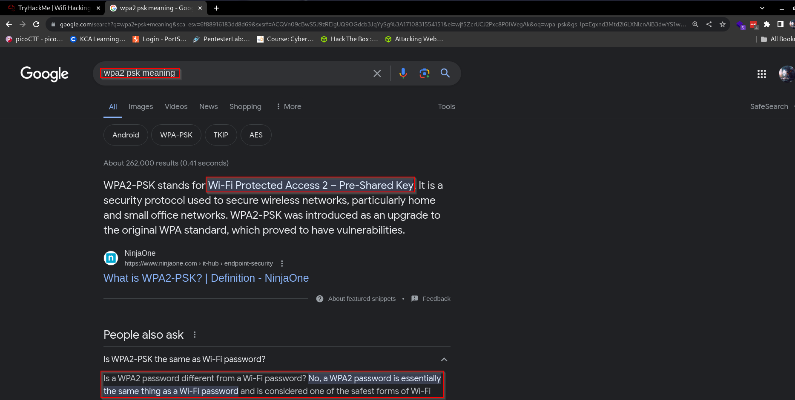
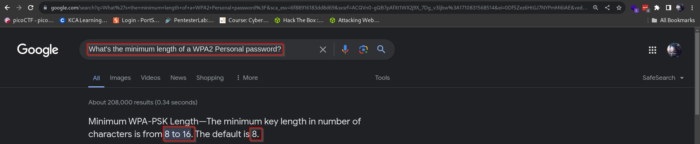
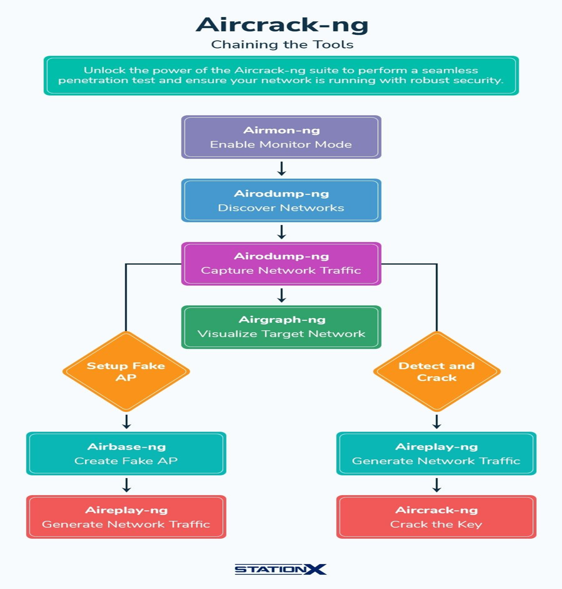
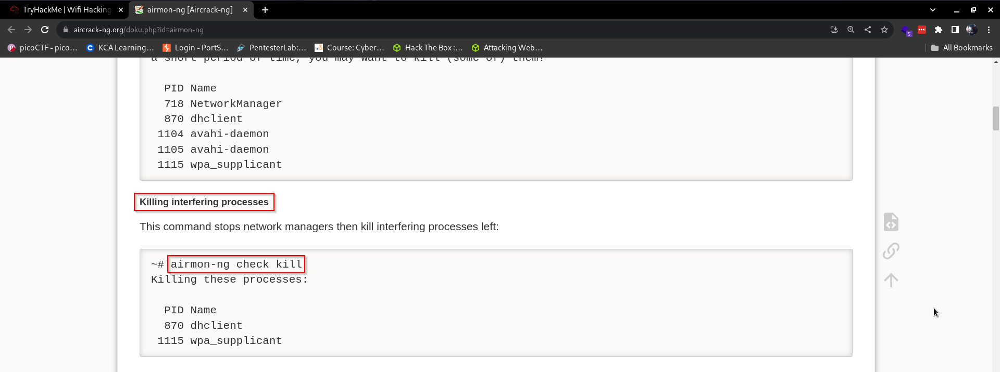
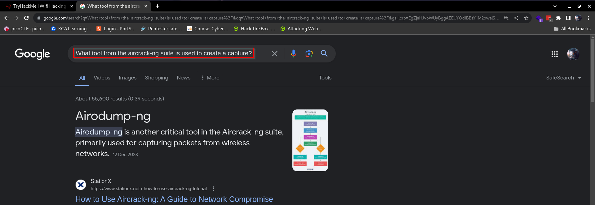
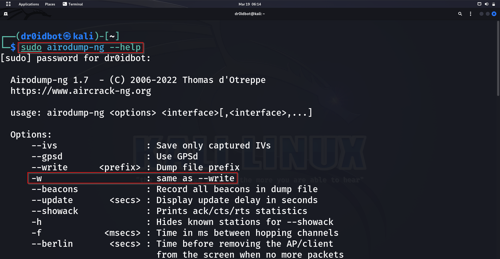
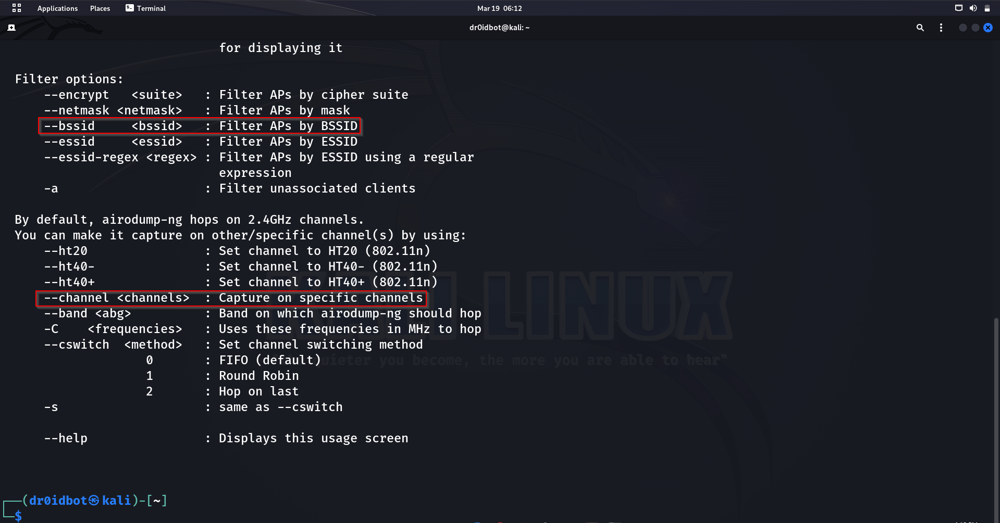
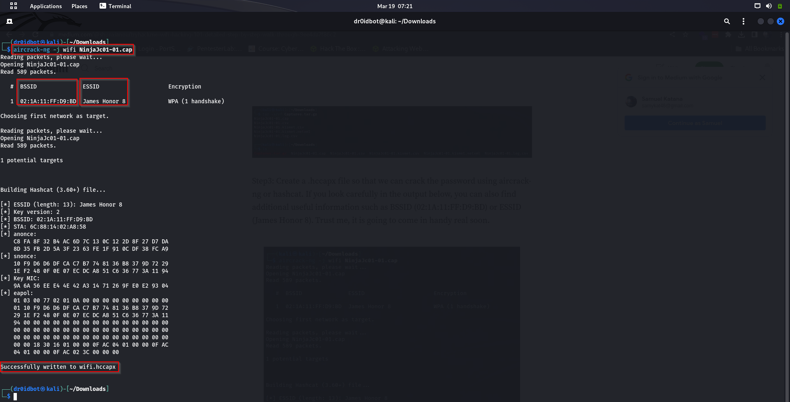
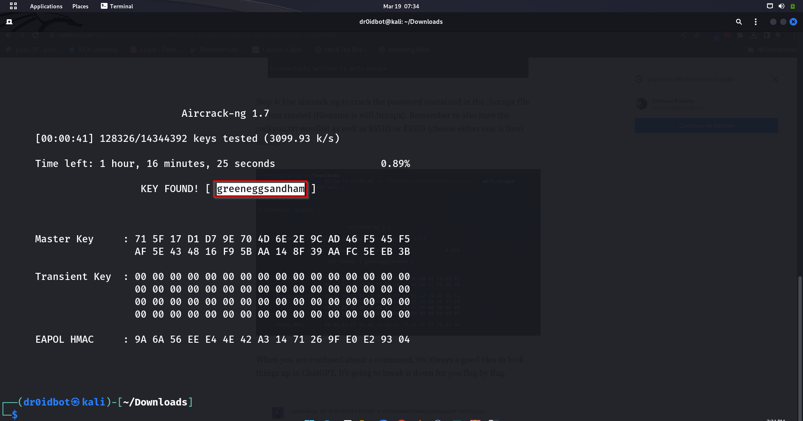

## Introduction
We all use Wi-Fi on a day-to-day basis. There is a lot that happens under the hood of this technology that we are all fond of and rely on every day. This room goes through some of the basics of this technology before we start learning about how to attack such network setups. Let’s dig in. If you wish to follow through, check out the room on TryHackMe called [WIFIHacking101](https://tryhackme.com/room/wifihacking101)

_Disclaimer: The content presented in this article is for educational purposes only and does not endorse or encourage any form of unauthorized access or malicious activity._

### An Intro to WPA
In this section, we go through some of the basics of WIFI technology by going through some terminologies. Some of the discussed terminologies are:
- Wi-Fi Protected Access (WPA) is a security standard for computing devices with wireless internet connections. Very susceptible to brute force attacks.
-	WPA2-PSK: Wifi networks that you connect to by providing a password that's the same for everyone.

Take note that PSK stands for Pre-Shared-Key and is essentially what we commonly refer to as the WIFI password. Its also important to note that it has a minimum number of characters requirement as shown below:

-	WPA2-EAP: Wifi networks that you authenticate to by providing a username and password, which is sent to a RADIUS server.
-	RADIUS: A server for authenticating clients, not just for wifi.
-	SSID: The network "name" that you see when you try and connect.
-	ESSID: An SSID that *may* apply to multiple access points, eg a company office, normally forming a bigger network. For Aircrack they normally refer to the network you're attacking.
-	BSSID: An access point MAC (hardware) address

## Capturing Packets to attack
The most common tools used in WIFI hacking are found in the aircrack-ng suite which comes which consists of tools such as: 
- Aircrack-ng
- Airodump-ng
- Airmon-ng

which mostly attack WPA(2) networks. You also need to ensure you have a monitor mode Network Interface Card (NIC) to capture the 4-way handshake used by WPA networks. If you need results fast, it is good to use injection mode, which de-authenticates a client from the WIFI and forces the handshake to re-occur as the client tries to reconnect to the network.

Most of the commands used for tools within this suite can be found on [this](https://www.aircrack-ng.org/doku.php?id=airmon-ng) page. We are going to go through some of the basic ones below. But first, here is an overview and summary of things we can do to exploit WPA/WPA2 networks in a flowchart:

The image above is courtesy of [StationX](https://www.stationx.net/how-to-use-aircrack-ng-tutorial/). Note that we are not going to go through everything in this chart but just the basics.
To enable monitor mode on our NIC we use the command:
```
airmon-ng start wlan0
```
Which will give you an output like so:

We can see that the interface name changes to wlan0mon. Oftentimes, there might be other processes currently using the network adapter we want to use or intend to use, therefore it’s a common practice to run this command first: 
```
airmon-ng check kill
```
Which will kill all interfering processes and give you a similar output to this one:

Now that our machine's Network Interface Card(NIC) is in monitor mode, we need to capture some packets that we can use for our attack. But what tool in the suite do we use, let's do a quick search on google:

As shown above, we have a tool from the aircrack-ng suite for this exact task, the tool is called: airodump-ng
Let’s have a look at its usage by viewing its help menu. We do that by running the command:
```
sudo airodump-ng --help
```

Notice the -w option or flag that writes the captured packets to a file. Scrolling down further, we notice other useful flags that we can use:

The –bssid flag is used to set the BSSID to monitor and the –channel flag that sets the channel. There are many options that can be of use while working with this tool. All are listed on the help menu, which we can access using 
```
sudo airodump-ng –-help
```
Let’s dive into a more practical part of it which is also the last bit. We can now assume that we managed to capture some traffic for a network that we intended to attack. In our case, we have the capturing part done for us, since we maybe don't have a NIC that can go to monitor mode or don't have a wireless adapter to do the capturing or injection. We are going to use a packet capture file that is provided to us, so let's first extract it:

Notice the NinjaJ-01.cap file, which is what we are going to use next to create a file that will help us crack the password. To do that, we use the command: 
```
aircrack-ng -j wifi NinjaJc01.cap
``` 
- aircrack-ng: Tool from suite that we are using for this task
- The flag -j: flag that specifies generation of a file from the pcap file specified into one that can be used to crack the password by aircrack-ng or hashcat.
- wifi: name of new file to be generated if the command successfully runs.
- NinjaJc01.cap: The file we are generating our new file from.

In the output below, notice that we now have the MAC address and Name of the WIFI network that we are trying to gain access by cracking the WIFI’s password.

The command successfully executes, meaning we can move forward and attempt cracking the password. As shown below, we can see that a new file names wifi.hccapx has been generated for us to use in our next step. We can now run the command:
```
aircrack-ng -a2 -b 02:1A:11:FF:D9:BD -w /usr/share/wordlists/rockyou.txt wifi.hccapx
```

Let’s break down the command to bits:
- aircrack-ng: Main command for Aircrack-ng tool usage from the main suite.
- The flag -a2: This option specifies the attack mode. In this case, -a2 indicates a dictionary attack. A dictionary attack involves trying each word from a provided wordlist (dictionary) to crack the passphrase.
- The flag -b 02:1A:11:FF:D9:BD: This option specifies the BSSID (MAC address of the access point) of the target network. The -b option is followed by the BSSID of the target network to focus the attack on a specific network.
- The flag -w /usr/share/wordlists/rockyou.txt: This option specifies the wordlist (dictionary) to use for the dictionary attack.
- wifi.hccapx: This is the name of the capture file containing the handshake packets captured from the target Wi-Fi network. Aircrack-ng uses this file as input for the cracking process.
After letting this run for a while, we are now able to get the password for this WIFI as shown in the output below:

With that, we are done covering the basics of WIFI hacking. It is important to know that password cracking is a resource-intensive process and therefore works faster on GPUs as opposed to CPU usage.
## CONCLUSION
We covered the basics of WIFI hacking by starting us off with basic terminologies that we were to hear mentions of in the walkthrough, which was a lot of interesting theory. Then gradually moved to the practical bit of the work. It was fun to interact with some of the tools within the airmon-ng suite for WIFI or wireless attacks and I hope we all learned a thing or two along the way.
