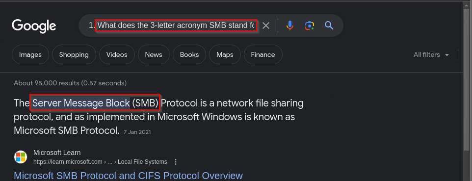
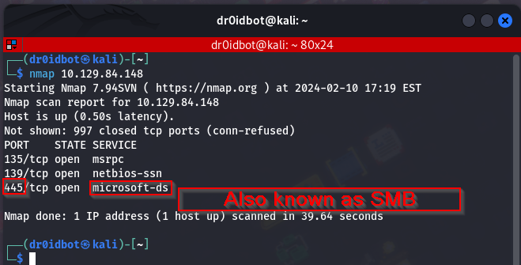
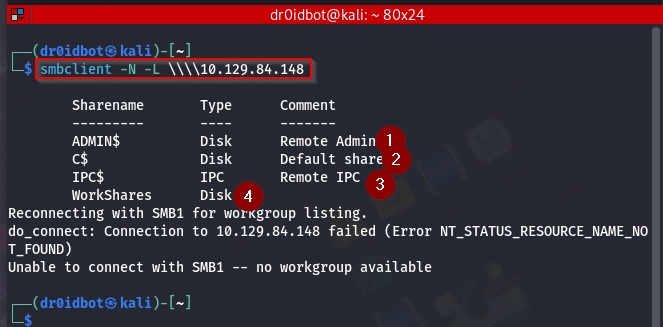
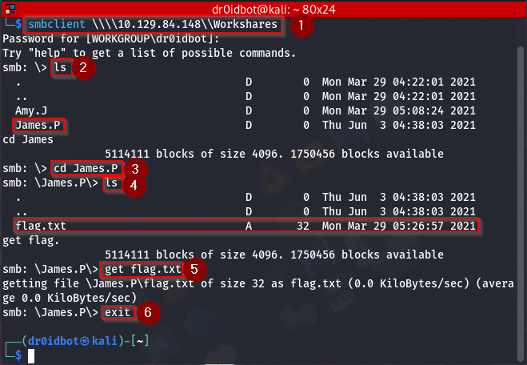
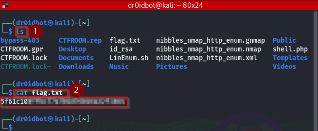

### Introduction
This challenge is about the basics of SMB and how misconfigurations can lead to compromise of the system SMB is running on. SMB is an acronym for Server Message Block, a protocol used in networks for file sharing that is implemented on Microsoft Windows operating systems. A quick Google search can reveal the same: 
 

_Disclaimer: The content presented in this article is for educational purposes only and does not endorse or encourage any form of unauthorized access or malicious activity._

**Note** If you're following through practically, make sure you use the target's machine's IP provided once you click the start machine icon on the challenge webpage.

### Enumeration.
Once you spawn the target, you are given a vulnerable target's IP (in my case: **10.129.84.148** ) which we will enumerate by use of NMAP by running the command: 
```
nmap 10.129.84.148

```
which should scan and give us a report on open ports running on the target as shown below:


We see that the target has three open ports and one specifically running **Microsoft-ds** on port 445.

### Observations & Findings
Now that we know the service running on this port, we can try and list the shares available on the target by running the command: 

```
smbclient -N -L \\\\10.129.84.148

```
The **-N** option suppresses the password prompt that is needed to connect to this service, **-L** on the other hand lists the shares available on the target. Here are the results from our target.

 

We already know the shares available on the target, so I can now try to connect to each of the available shares, but I don't have a password, so I am going to try to log in to each of them without giving a password. 

### Foothold
Things don't seem to go as planned, except for just one share that lets me in without a password, the WorkShares share. Here is the command I ran to be able to connect to it:

```
smbclient \\\\10.129.84.148\\WorkShares

```
When prompted for a password, press enter. 
 

Now we list the directories available using **ls** and see a couple of interesting stuff here, in essence, there are two users listed:
* Amy.J
* James.P

I check the first user's folder, but there is no sign of the flag. Next, I try to navigate to the second user's folder.

### Solution/Flag
I do this by running the following command:
```
cd James.P

``` 
Then I list the contents of his directory where we see a file called **flag.txt** which we then download to our attack machine using:
```
get flag.txt
```
Then leave this service by running the **exit** command.

Now since we are back on our attack machine we can navigate to the directory where the flag file is saved and view its contents.
 

We have our flag for this challenge. That also leaves us with all the answers  to the questions that came with this challenge.

### Conclusion
In summary, the SMB protocol is very useful in sharing resources between hosts. However, a big security risk is onboarded if this protocol is misconfigured. This room has shown me how easy it can be to gain access to shares within an SMB if there are few to no strict security measures associated with it.

dr0idbot signing off.
