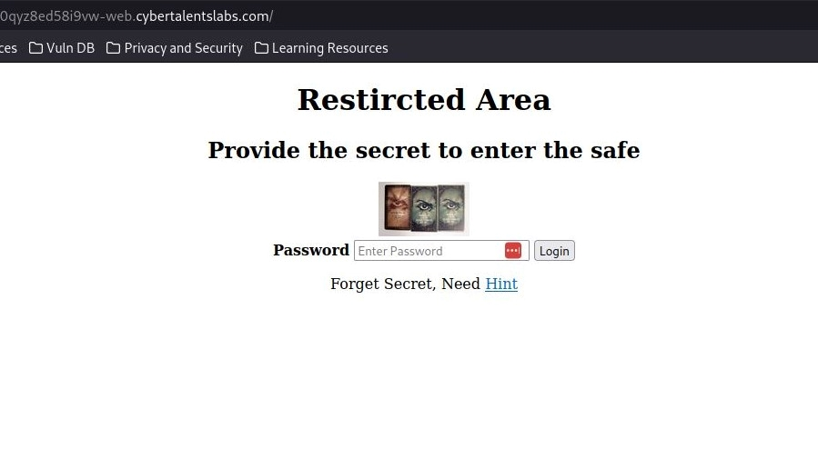
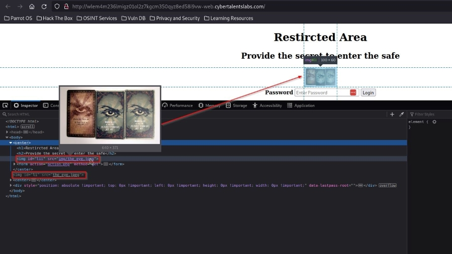
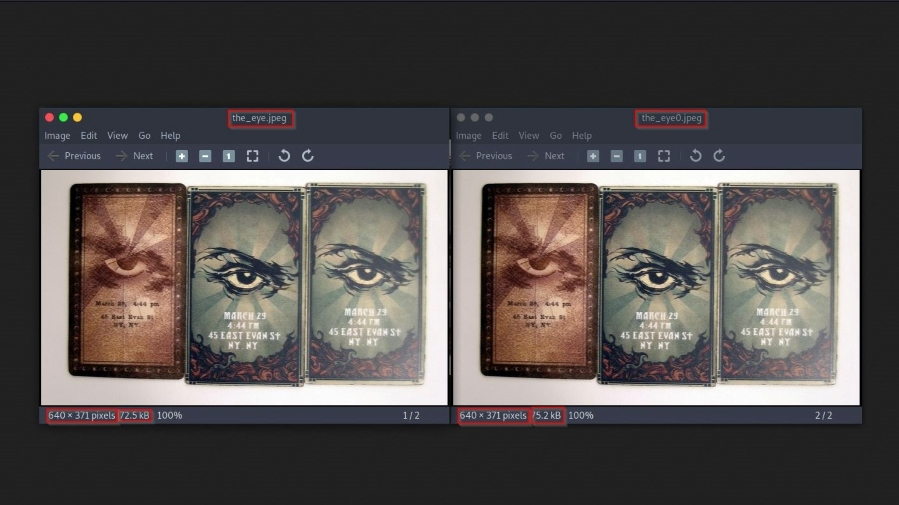
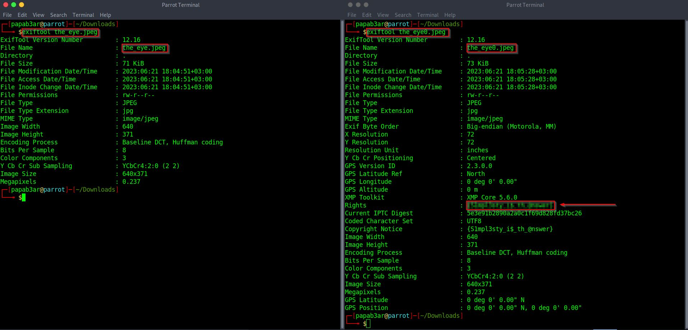

### Introduction
Welcome to another exciting journey into the world of Cybersec and its mysteries! In this blog post, we'll explore a captivating gamified challenge in the field of Digital Forensics. Join me as we dive into the intriguing world of [Capture The Flag](https://en.wikipedia.org/wiki/Capture_the_flag_(cybersecurity)) and unravel the secrets behind the challenge titled 'Keep it Simple.' This challenge is part of the **Introduction to Cybersecurity (Online)** series that I have been looking into over the past few days and can be found [here](https://cybertalents.com/challenges/forensics/keep-it-simple).

_Disclaimer: The content presented in this article is for educational purposes only and does not endorse or encourage any form of unauthorized access or malicious activity._

### Unveiling the Enigma: Keep it Simple Challenge.

The challenge description had the string: _The answer is simple_(as you will see, it truly is simple). The more one can gather from here is that it's a Digital Forensics challenge titled: *Keep it simple* Upon clicking the green "Start Challenge" button, I was presented with a link to a webpage that looks like this:

### Observations & Findings

As usual, the first thing I always try to do with these challenges, is to inspect the page where its hosted for hints or clues on how to proceed with an attempt. The trick is to be as keen as you can when doing this so as not to miss on any breadcrumbs :D. At first glance, the webpage source code looks normal but on taking a closer look you notice a reference to two images with only one being embedded on the webpage. My curiosity kicked in:

So I downloaded both the images, to get a closer look and see if there is something out of the ordinary about them. The first image that was embedded on the webpage I saved as is, that is *the_eye.jpeg* and image two (hidden hint in source code) saved as *the_eye0.jpeg*. Again at first glance, everything about this images looks the same, from file size, dimensions of the image and most obviously their outlook. So we have to use  the eye of a thief, to see what others dont. Here is a glimpse of both the images:

Next, I decide to compare the images using [diff](https://www.geeksforgeeks.org/diff-command-linux-examples/) command from the terminal to compare if the images are actually the same or not. Here is the output from the comparison:

We are seeing here that the two files actually differ, which makes me more curious and I therefore decide to look at the images [metadata](https://iptc.org/standards/photo-metadata/photo-metadata/) using the [exiftool](https://en.wikipedia.org/wiki/ExifTool) and here out attention is drawn to the difference of the two images that we normally wouldnt have seen from just looking at the pictures.

**I try as much as I can to link additional information on new terms and tools used in the blog check them out to learn more.**

### Solution/Flag

To look at the metadata of both the images we type the command *exiftool* followed by the filename. See the image below for output comparison.

.

**Kudos!!** We now captured the flag.I have obfuscated the flag to keep the integrity of the challenge.

### Conclusion

In conclusion, this challenge reminds us that sometimes the answers are simple and can be found in plain sight. By honing our observation skills and utilizing powerful tools like diff and exiftool, we can uncover hidden secrets. Remember, even in the world of cybersecurity, simplicity can hold the key to success. Keep exploring, keep hacking, and never stop learning! Happy Hacking. dr0idbot out.
