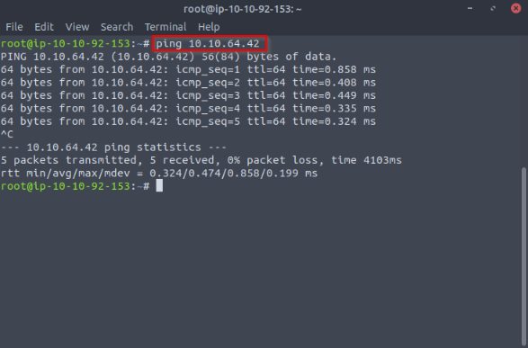
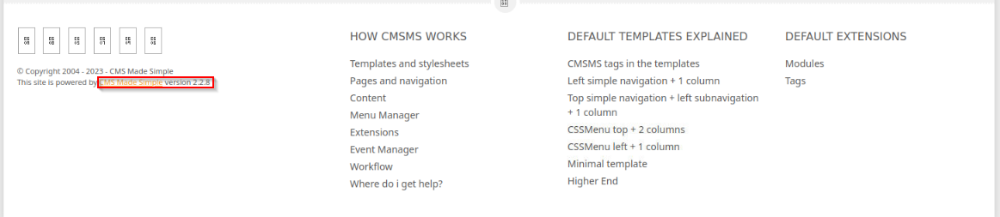

### Introduction
Hello guys, it has been quite some time since I made a CTF writeup and I figured it's time to share some of my notes with you. Like many of you, I am a beginner and I am still learning and exploring stuff in cyber security. Just recently I got interviewed by [CyberShujaa](https://cybershujaa.co.ke/) as I had applied to be a scholar in their program for the Security Analyst path. I am happy to say that I have been shortlisted for the program. As part of the admission process, I was required to try out this beginner-level CTF challenge and I thought it wise to take some notes while solving it. You can find the challenge [here](https://tryhackme.com/room/easyctf#).

_Disclaimer: The content presented in this article is for educational purposes only and does not endorse or encourage any form of unauthorized access or malicious activity._

### SimpleCTF Challenge.
After clicking the start machine icon on the challenge webpage, you are presented with an IP of the vulnerable target, the first thing I normally do is to ping the target just to see if it is alive. 


Since we have replies from the target we will now proceed to the next step of exploration.

### Observations & Findings
We begin by scanning the target using the tool [Nmap](https://en.wikipedia.org/wiki/Nmap)  to find open ports running on it and also identify the services running on those ports. to do that, we use the command: 

```
nmap -sV 10.10.64.42

```
**Note** If you're following through the tutorial, make sure you use the target's machine's IP provided once you click the start machine icon on the challenge webpage. Here are the results from our scan.

 

Notice that we have three open ports.

* Port 22 running ftp
* Port 80 running HTTP
* Port 2222 running SSH

Now we try accessing the webpage running on port 80 by pasting the IP and port number (80) for the service on the browser and we are welcomed with this page:


There is not much going on here so I decided to brute force the target's website to see if I can find other web pages that might be helpful in this quest. For this, I use [Gobuster](https://en.wikipedia.org/wiki/Gobuster) using this command:

```
gobuster dir -u http://10.10.64.42:80 -w /usr/share/wordlists/directory-list-2.3-small.txt

```
Here are the results from the brute force attack:


We discover a directory _/simple_ that we now visit on the browser and find this:
 
When we scroll down to the footer of the webpage, we find something interesting:

What comes to sight is the version number of the tool that was used to build this website. So I run a quick Google search about its vulnerabilities and possible exploits. It is discovered that CMS Made simple version 2.2.10 and below are vulnerable to SQL Injection. I found a good Python script that can be used to exploit this vulnerability [here](https://gist.github.com/kriss-u/321f0418778697e2ec919f04664ceb4b).

I download the script and try to run it to see its usage:
. 

After seeing its usage, we can now decide the syntax to use for the exploit to work on the target depending on our needs. so we use the command: 

```
python3 cmsexploit.py -u http://10.10.64.42:80 --crack -w /usr/share/wordlists/rockyou.txt

```

After running for a while we get the following output as shown below, and it contains:

* The salt for the password some identified user
* The user's username
* Their email address
* Hashed password
* The cracked password


Now that we have some credentials let's try them out on another service that we found running on the target **SSH**. The command for logging in on ssh using the username and password that we found is: 

```
ssh mitch@10.10.64.42 -p2222

```
Then type yes and accept to proceed and provide the acquired password. A successful login should land you at a terminal like this:


### Solution/Flag
Now that we are logged in as Mitch I try to list the contents of his home directory and voila, we capture our first flag which is in the user.txt file.


I then try to go back to see if there is any other user on this machine and if I have access to their directory. I found another user **sunbath** but have no access to his directory. I moved back to another directory and tried to gain access to the root's directory but again, I hit a wall. 


I run the command: 

```
sudo -l 

```
to see what permissions Mitch has or what he can run as root without having to provide a password. The results: 
 

We gain access to the root shell after  finding out that he can access vim as root. To find the custom command to cater to your needs use [this](https://gtfobins.github.io/) website. Now that we're root, let's confirm that and see if we have access to the root's directory. 


### Conclusion
In summary, this challenge underscores the significance of privilege escalation techniques for unearthing concealed data and vulnerabilities. By leveraging the use of tools and exploits, directory permissions, and sudo privileges, we elevate our access and seize the flags.

Remember, relentless learning and exploration are paramount to mastering hacking skills. Embrace the journey, and let the quest for knowledge fuel your hacking endeavors.

dr0idbot signing off.
