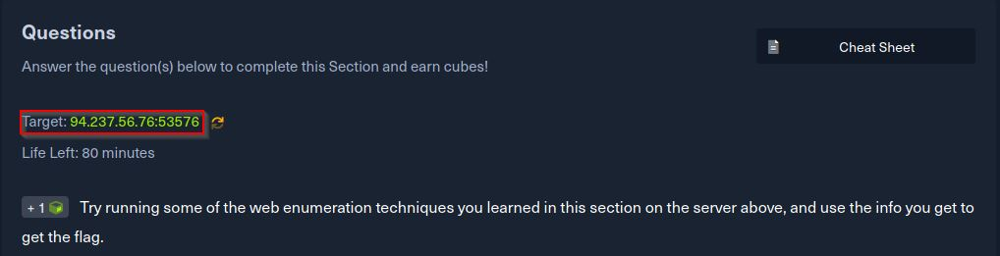
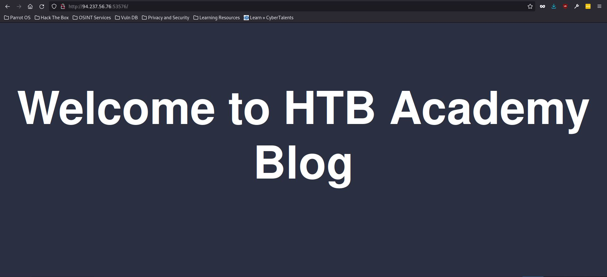
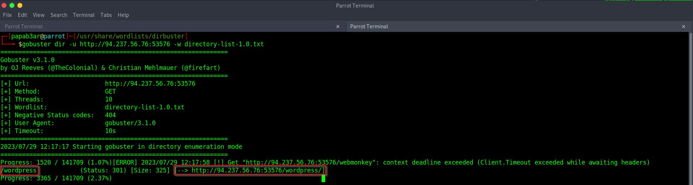
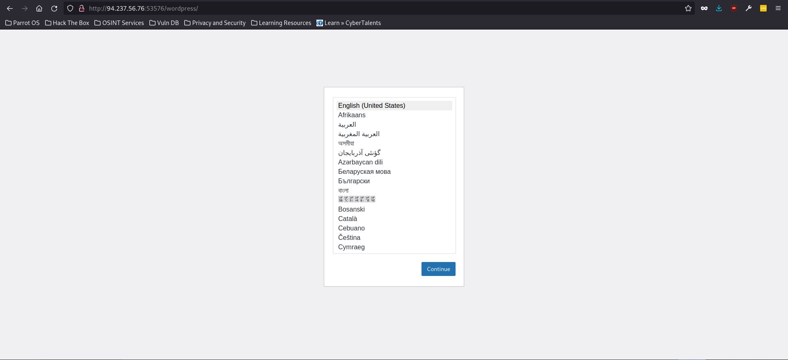
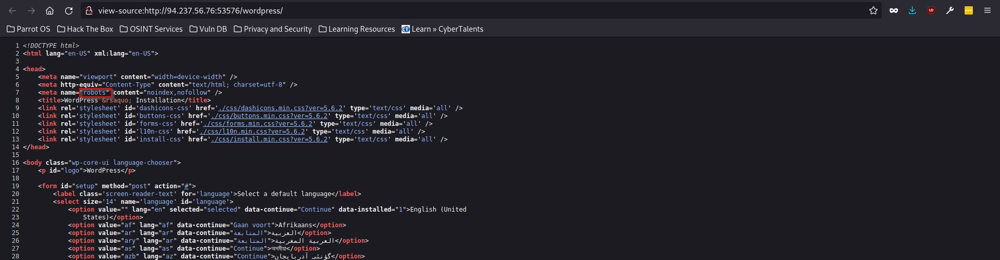
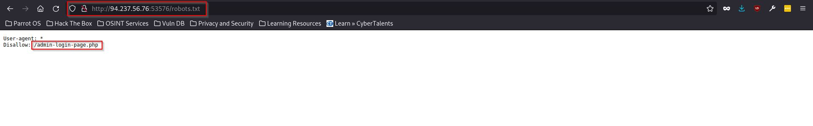
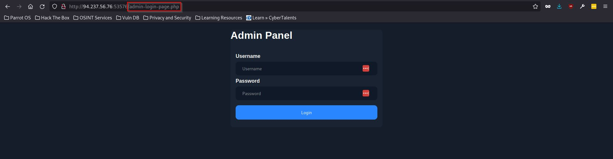
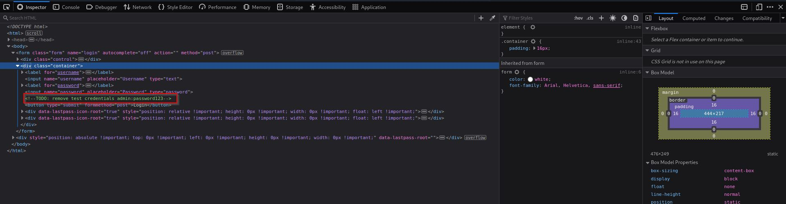

### Introduction
Hello friend :) I know it has been a while but, welcome to another writeup from a challenge discovered at one of the best learning platforms for hackers [HackTheBox](https://academy.hackthebox.com/). This challenge is part of the **Getting Started** module and can be found [here](https://academy.hackthebox.com/course/preview/getting-started).  It is an excellent starting point for those interested in offensive security or red teaming.

_Disclaimer: The content presented in this article is for educational purposes only and does not endorse or encourage any form of unauthorized access or malicious activity._

### Web Enumeration Challenge.

The challenge instructions were straightforward: "Try running some of the web enumeration techniques you learned in this section on the server above, and use the info you get to get the flag." The focus of the challenge was to apply web enumeration techniques to assess the security of websites. By copying the target IP address and visiting the associated webpage, We are greeted with some welcome text to the "HTB blog page".

### Observations & Findings

Upon first inspection, there wasn't much information visible on the webpage. My next step was to inspect the page's underlying code, which is often a good starting point for such challenges. Unfortunately, even after inspecting the code, I didn't find anything substantial. So, I decided to leverage the tool [gobuster](https://www.kali.org/tools/gobuster/) to perform a brute-force attack on the website and find other directories.

This approach paid off as I discovered a directory. Navigating this directory revealed a page that appeared to be under construction, possibly an incomplete WordPress site.

Once again, I decided to inspect the page's code, hoping to find something useful. This time, I stumbled upon a section related to web crawlers. Web crawlers, also known as spiders or spiderbots, systematically browse the World Wide Web on behalf of search engines for indexing purposes. Websites often use a file called robots.txt to instruct or block these crawlers from accessing certain web directories.

Armed with this knowledge, I attempted to access the robots.txt file to view its contents.

Once again, I inspected the code of this page and came across some interesting comments. It seemed that the web developer forgot to remove the comments containing login credentials for the admin user.

Page code inspection follows: 

### Solution/Flag

Using the credentials found in the comments, I successfully logged in as an admin user, which led me to a new page containing the flag for the challenge.

### Conclusion

In conclusion, this challenge provided a great opportunity to apply web enumeration techniques to uncover hidden information and identify potential vulnerabilities. The process involved inspecting the underlying code, using gobuster for directory enumeration, understanding the significance of robots.txt files, and recognizing the importance of secure coding practices.

As a hacker, it's crucial to continuously explore and learn new techniques. Happy hacking, and never stop learning!

dr0idbot out.
